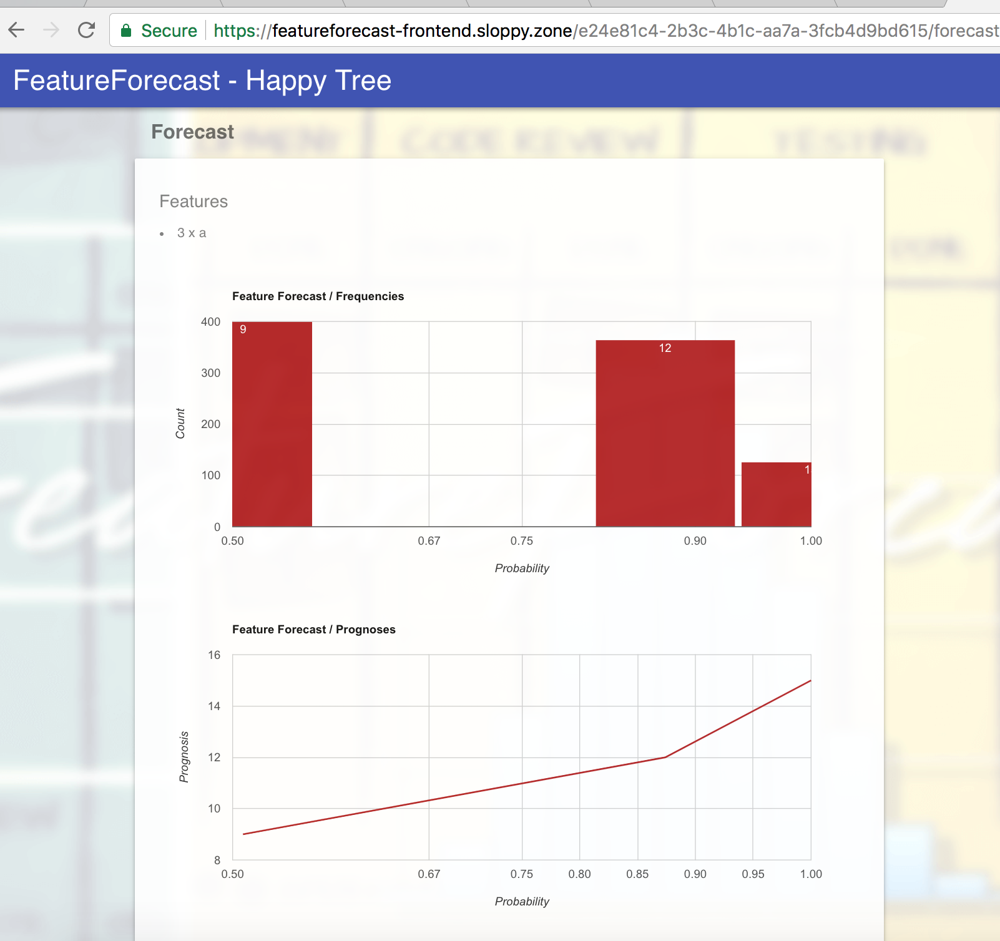

# featureforecast
Forecast Features based on historic data



Read more about Featureforecast: [Details](documentation/featureforecast.md)

live demo: https://featureforecast-frontend.sloppy.zone

## frontend
```
cd frontend/build
yarn install
run // will display available 'run' tasks, e.g run docker:build
```

Read more about the build system: [read more ...](development/frontend/build/README.md)

Read more about Frontend Testing (Playground-UI): [read more ...](documentation/cosmos.md)

## backend
```
cd backend/build
yarn install
run // will display available 'run' tasks, e.g run docker:build
```

[read more about Backend build system](development/backend/build/README.md)


